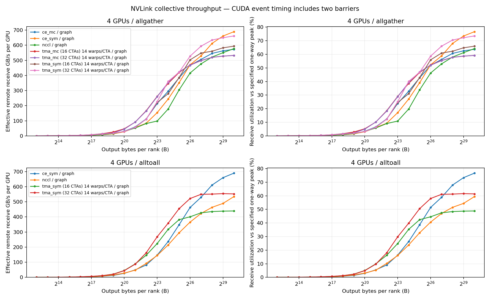
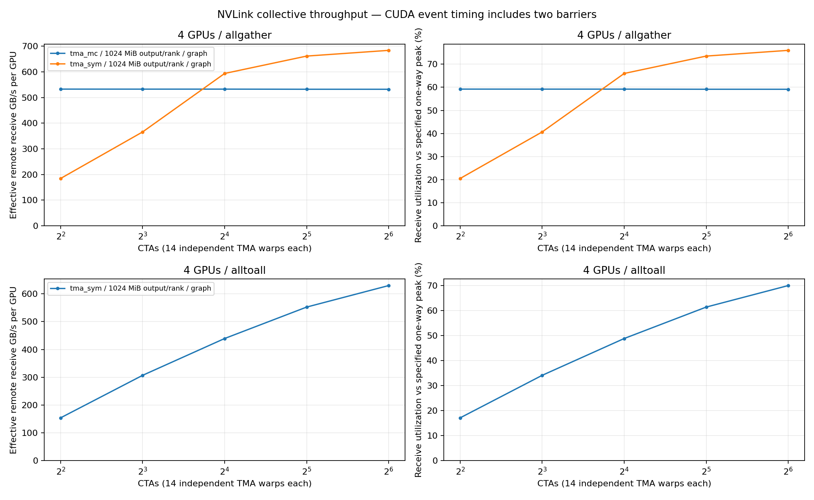

# GB200 NVLink 4 卡 CTA sweep：output bytes/rank

以每 rank 输出数据量为横轴。4 KiB–1 GiB 共 19 个输出量，TMA 固定 16 KiB tile、
14 warps/CTA，CTA 扫描 4 / 8 / 16 / 32 / 64。380 项全部正确性通过。

4 × GB200，NV18，PyTorch 2.9.1，CUDA 13.1，NCCL 2.27.5。
每项 warmup 5 次，CUDA Graph 内 20 次 collective，5 个 trial；
每个 trial 取最慢 rank 后求中位数。计时包含两次 stream barrier 和 self shard copy。

## 1 GiB output / rank

| Pattern   | 输入/rank | 每目标 shard | 输出/rank | 远端接收/rank |
| --------- | ------- | --------- | ------- | --------- |
| Allgather | 256 MiB | 256 MiB   | 1 GiB   | 768 MiB   |
| Alltoall  | 1 GiB   | 256 MiB   | 1 GiB   | 768 MiB   |

带宽分子统一为每 rank 远端接收的 768 MiB；单位 GB/s/GPU。

| CTAs | AG symmetric | AG multicast | A2A symmetric |
| ---- | ------------ | ------------ | ------------- |
| 4    | 184.3        | 532.9        | 154.2         |
| 8    | 365.9        | 532.8        | 307.0         |
| 16   | 593.9        | 532.8        | 439.4         |
| 32   | 661.8        | 532.3        | 552.4         |
| 64   | 684.1        | 532.3        | 629.7         |

同轮 NCCL / CE baseline（1 GiB output/rank）：

| Pattern   | Backend | Remote GB/s/GPU | 单向 900 GB/s 利用率 |
| --------- | ------- | --------------- | --------------- |
| allgather | nccl    | 577.7           | 64.2%           |
| allgather | ce_sym  | 689.9           | 76.7%           |
| allgather | ce_mc   | 573.4           | 63.7%           |
| alltoall  | nccl    | 534.7           | 59.4%           |
| alltoall  | ce_sym  | 689.8           | 76.6%           |

## 数据与图

输出量曲线仅显示 TMA 的 16 / 32 CTA 配置及全部 NCCL/CE baseline；其他 CTA 配置见 CTA sweep 图。
CTA sweep 图仅显示 1 GiB output/rank。

- [原 output-based CSV](measurements/gb200_4gpu/sweep4.csv) / [metadata](measurements/gb200_4gpu/sweep4.metadata.json)
- [CTA 横轴 SVG](assets/ctas.svg)
- [输出量横轴 PNG](assets/bandwidth.png) / [SVG](assets/bandwidth.svg)

### 输出量横轴：带宽与利用率

### CTA 横轴：1 GiB output/rank

CTA 数不等于实测活跃 SM 数。GB/s 为有效远端接收带宽，不是双向带宽或硬件计数器。
小消息可能命中 L2，且同步延迟占比较大。未锁频或隔离其他节点 NVSwitch 流量，结果不是硬件绝对上限。
当前展示的数据和 metadata 归档于 `measurements/gb200_4gpu/`；后续运行的临时结果写入 gitignored `results/`。
