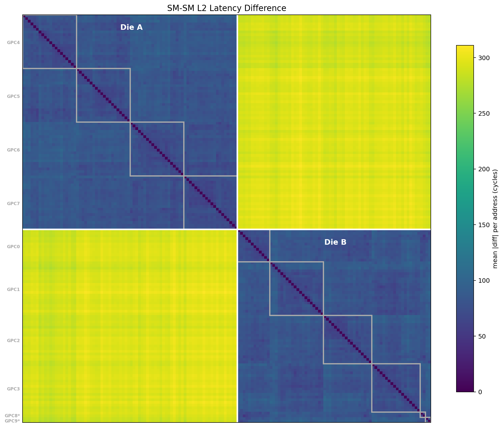
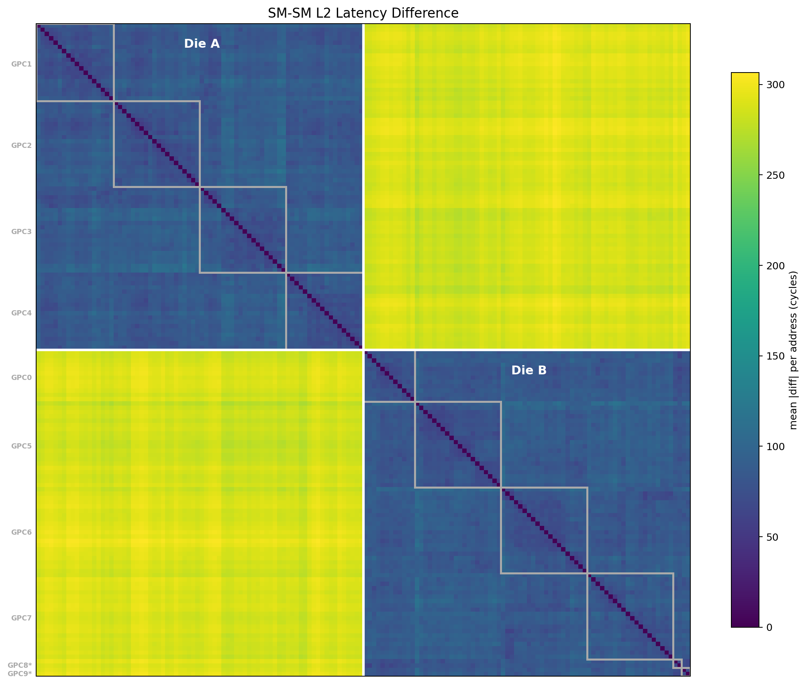

# GB200：原版 SM–SM L2 latency difference 复测

测试日期：2026-10-01。以文中所列 Git 提交为基线，**只修改 SM 数量 148 → 152**，重新在 GPU 0 和 GPU 1 上运行。`l2_pointer_chase.cu` 和 Makefile 相对基线均只修改 SM 数量。

## 结论

原版程序在 GPU 0 和 GPU 1 上测得明显的 die 级访存延迟 profile 差异：跨 die 的 SM 对访问同一地址集合时，其延迟模式差异大于同 GPC 或同 die 的 SM 对。

下表使用独立 RM 查询的 die/GPC 映射对测量 CSV 分类。数值是每对 SM 的 `mean_address |L_i-L_j|`，再对该类别内的 SM 对取中位数，单位 cycles。

| SM 对类别 | GPU 0 | GPU 1 |
|---|---:|---:|
| 同 TPC | 68.10 | 72.45 |
| 同实际 GPC | 73.65 | 78.80 |
| 同 die、不同 GPC | 82.70 | 87.60 |
| 跨 die | 294.55 | 288.50 |

同 GPC 包含同 TPC，所有类别均排除同 SM 的对角线。表中数值不是远端/本地访问延迟，也不是 SM 之间的通信耗时。

## 原版生成的图

下面两图由 **Git 原版 `plot_distance.py`** 直接读取原版 CSV 生成。Die A/B 是原脚本的聚类标签，不是 RM die 0/1 的固定编号；图片中的 GPC 数字是原探测的逻辑分组编号。它们与驱动 GPC ID 不是同一套编号。

### GPU 0



### GPU 1



另用测量矩阵做 average-linkage 二分并与 RM 标签比较（允许两组标签交换），两卡的 SM 分类一致率分别为 GPU 0: 100.00%, GPU 1: 100.00%。这是独立后处理验证，不是原版采样过程的一部分。

## 改动严格限定

Git 基线：`c365efbc0c882bae2c0a5efb0b9501c9b98a931b`。源码唯一变化：

```diff
-#define NUM_SMS 148
+#define NUM_SMS 152
```

Makefile 唯一变化是同样把默认 `NUM_SMS ?= 148` 改成 152，避免 `-DNUM_SMS=148` 覆盖源码默认值。编译选项使用 `-O2 -std=c++17` 和原版 sm_100a/compute_100a gencode。测量 kernel、计时方式、采样统计和绘图脚本均保持原版。

[源码 diff](results/gb200_original_20261001/l2_pointer_chase.cu.diff) · [Makefile diff](results/gb200_original_20261001/Makefile.diff) · [构建日志](results/gb200_original_20261001/build.log) · [文件校验和](results/gb200_original_20261001/checksums.json)

## 实际运行条件

- 本机两张空闲 GB200（GPU 0 / GPU 1），每卡 152 SM；驱动 580.126.20，CUDA Toolkit 13.1.115。
- 原版默认参数，无命令行参数：完整 L2-capacity 链，129.25 MiB、1,058,816 节点、5 passes。
- 通过 `CUDA_VISIBLE_DEVICES=0` / `1` 分别选择卡；原程序内部仍使用 device 0。
- 两次运行目录独立，并事先创建原版要求的 `results/` 子目录。
- 两张卡的原版日志首轮均打印 `Unique SMs: 152 / 152`。原版不记录后续各轮 SM 映射稳定性，本次没有为此改代码，不能宣称验证了每一轮的映射不变。
- 原版输出每卡152×152差异矩阵；后处理检查对称、零对角线、有限数值，并保存 RM 分类统计。
- 未改变功率上限、时钟、MIG 或驱动。

| GPU | 全部程序墙钟时间（含 CPU 建链与后处理） | 各 SM 平均访问计时的均值 |
|---|---:|---:|
| 0 | 131.98 s | 721.94 cycles |
| 1 | 132.90 s | 712.36 cycles |

程序总墙钟时间包含 CPU 建链和后处理，不能当作 GPU kernel 时间。原版没有采集 CUDA event 时间。

## 复现原版

从仓库根目录执行。当前源码和 Makefile 均只保留 SM 数量修改。每次选择新的输出目录。

```bash
make -C sm_l2_distance NUM_SMS=152
mkdir -p /tmp/l2_original_gpu0/results
cd /tmp/l2_original_gpu0
CUDA_DEVICE_ORDER=PCI_BUS_ID CUDA_VISIBLE_DEVICES=0 \
  /opt/tiger/microbench-blackwell/sm_l2_distance/l2_pointer_chase \
  > results/distance.csv 2> run.log
python3 /opt/tiger/microbench-blackwell/sm_l2_distance/plot_distance.py \
  results/distance.csv
```

GPU 1 使用新的目录并设置 `CUDA_VISIBLE_DEVICES=1`。

已保存 CSV 的分类统计可以直接重算：

```bash
python3 sm_l2_distance/results/gb200_original_20261001/analyze_results.py
```

## 数据和解释边界

- [GPU 0 原始 CSV](results/gb200_original_20261001/gpu0/results/distance.csv)、[运行日志](results/gb200_original_20261001/gpu0/run.log)、[原版画图日志](results/gb200_original_20261001/gpu0/plot.log)。
- [GPU 1 原始 CSV](results/gb200_original_20261001/gpu1/results/distance.csv)、[运行日志](results/gb200_original_20261001/gpu1/run.log)、[原版画图日志](results/gb200_original_20261001/gpu1/plot.log)。
- [统计结果 JSON](results/gb200_original_20261001/summary.json)、[独立后处理脚本](results/gb200_original_20261001/analyze_results.py)、[本次 RM 原始查询](results/gb200_original_20261001/rm_topology.json)。

每卡完整的单 SM 延迟分布保留为 `gpu*/results/latency_profile.csv.gz`，使用 gzip 无损压缩；可用 `gzip -dc` 读取。编译生成的可执行文件不纳入 Git。

差异矩阵不是 SM↔SM 通信延迟矩阵；`.cg` 绕过 L1 不保证每次都命中 L2。并发采样、结果写回、缓存状态和计时指令均可能影响数值。本次没有使用 NCU 计数器验证纯 L2 命中，也没有测量 NV-HBI 链路延迟。每卡仅一次进程运行、包含五次 pass；没有跨分配重复实验的误差条。
